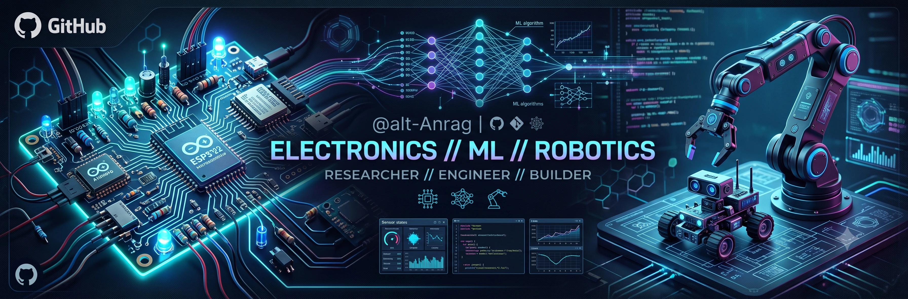

<div align="center">


# Hey there, I'm Anurag 👋
### 3rd-Year ECE @ DTU · Mechatronics Builder · Drone Tinkerer · Creative

[](https://www.linkedin.com/in/anurag2416/)
[](mailto:anuragjha7516@gmail.com)

</div>

---

## 🧠 About Me

```python
anurag = {
    "degree"    : "B.Tech ECE (ML Specialization) @ DTU '28",
    "cgpa"      : "8.56 / 10 · Top 15% of dept",
    "vibe"      : ["mechatronics", "prompt engineering", "drones", "hardware"],
    "currently" : "Building things that shouldn't exist yet",
    "fun_fact"  : "Reached 100K+ viewers through storytelling. Also solder PCBs."
}
```

> I'm the kind of person who trains AI on 10,000 X-rays, then designs the PCB for the device that captures the data. Currently in my 3rd year and already knee-deep in things that matter.

---

## 🚀 Featured Projects

<table>
<tr>
<td width="50%">

### 🦾 InkCat-SMOC
**5-DOF SCARA Design · ADI Anveshan 2026**

Full embedded electronics & PCB stack for a SCARA manipulator — **STM32H743** main controller, **STM32G431** actuator nodes, **TMC9660** FOC drivers, and IMU/optical sensor fusion (UKF/EKF) with ADRC control.

`STM32` `TMC9660` `PCB Design` `Sensor Fusion` `Embedded C`

[]([https://github.com/alt-Anurag/PocketLab](https://github.com/alt-Anurag/SMOC-InkCat-Reynced))

</td>
<td width="50%">

### 🏁 Zeroidea
**Custom PID-Controlled Line Follower**

Not a kit, not a tutorial clone — a line follower engineered from a blank sheet: custom **chassis, PCB, and control loop**, all built and tuned by hand.

`C++` `PCB Design` `PID Control` `Embedded Systems`

[](https://github.com/alt-Anurag/Zeroidea)

</td>
</tr>
<tr>
<td width="50%">

### 🔭 PocketLab
**Portable Oscilloscope & Function Generator**

Sub-₹3,000 DSO with **custom PCB**, Android/Windows interface, real-time signal viz & function gen up to **1 kHz**.

`KiCad` `C++` `Embedded` `PCB Design`

[](https://github.com/alt-Anurag/PocketLab)

</td>
<td width="50%">

### 🔬 XrayBotix
**AI Medical Diagnosis Platform**

Trained on **10,000+ X-rays** across chest, spine, dental & skull. Generates structured PDF diagnostic reports in **<30 seconds** with 94.8% accuracy.

`HTML` `JavaScript` `TensorFlow.js` `Gemini API` `Netlify`

[](https://github.com/alt-Anurag/XrayBotix)
[](https://xraybotix.netlify.app/)

</td>
</tr>
<tr>
<td width="50%">

### 🛍️ SnapShop
**Visual AI Product Search Tool**

Built with **CLIP embeddings + LLMs** over a 40K+ product database. Find & buy any product from a photo in **<45 seconds**.

`Python` `CLIP` `LLMs` `Web Scraping` `FastAPI`

[](https://github.com/alt-Anurag/SnapShop)

</td>
<td width="50%">

### 🚁 UAS-DTU
**Drone Avionics Work**

Avionics technician for DTU's drone team. Payload systems, flight controllers, and things that fly.

`Python` `ROS` `Embedded Systems`

[](https://github.com/alt-Anurag/UAS-DTU)

</td>
</tr>
</table>

---

## 🛠️ Tech Stack

<div align="center">

**Languages**


**AI / ML & LLMs**


**Development**


**Hardware & Design**


</div>

---

## 🏆 Highlights

| 🏅 | Achievement |
|---|---|
| 🚀 | **Team InkCat-SMOC** — Shortlisted for ADI Innovation 2026, one of only 16 Asian teams selected |
| 🎓 | **Dell Aspire Scholar** — Top 120 students in Delhi (Michael & Susan Dell Foundation) |
| 📐 | **JEE Main 98.97 percentile** · JEE Advanced AIR 9723 |
| 🥉 | **Samsung Galaxy AI Treasure Hunt** — Rank 3 |
| 🤝 | **E-Cell DTU** — Drove 50K+ footfall at E-Summit'25 |

---

## 🎬 Beyond the Code

When I'm not pushing commits, I'm probably shooting frames, scoring music, or wiring something that flies.
Member of **Reflect** (filmmaking), **Madhurima** (music) & **UAS-DTU** (drones) — because engineers contain multitudes.

---

<div align="center">

**Let's build something weird and useful.**

[](https://www.linkedin.com/in/anurag2416/)

</div>
